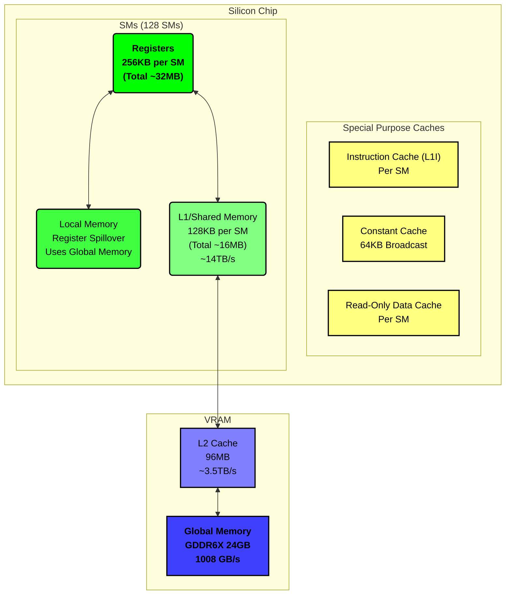

# CUDA Jumpstart

Quick overview of CUDA, memory hierarchy, basic syntax, and embedding in Python/C

---

## Requirements

Need an NVIDIA GPU with CUDA support

### NVIDIA Drivers

Check installation:
```bash
nvidia-smi
```
Sample output:
```     
+-----------------------------------------------------------------------------------------+
| NVIDIA-SMI 550.120                Driver Version: 550.120        CUDA Version: 12.4     |
|-----------------------------------------+------------------------+----------------------+
| GPU  Name                 Persistence-M | Bus-Id          Disp.A | Volatile Uncorr. ECC |
| Fan  Temp   Perf          Pwr:Usage/Cap |           Memory-Usage | GPU-Util  Compute M. |
|                                         |                        |               MIG M. |
|=========================================+========================+======================|
|   0  NVIDIA GeForce RTX 3080 Ti     Off |   00000000:01:00.0 Off |                  N/A |
|  0%   37C    P8             20W /  350W |     114MiB /  12288MiB |      0%      Default |
|                                         |                        |                  N/A |
+-----------------------------------------+------------------------+----------------------+
                                                                                         
+-----------------------------------------------------------------------------------------+
| Processes:                                                                              |
|  GPU   GI   CI        PID   Type   Process name                              GPU Memory |
|        ID   ID                                                               Usage      |
|=========================================================================================|
|    0   N/A  N/A      1779      G   /usr/lib/xorg/Xorg                             93MiB |
|    0   N/A  N/A      1925      G   /usr/bin/gnome-shell                           11MiB |
+-----------------------------------------------------------------------------------------+
```

Install (Debian/Ubuntu example, but confirm from [NVIDIA Drivers](https://www.nvidia.com/Download/index.aspx)):
```bash
sudo apt update && sudo apt install -y nvidia-driver
```

### CUDA Toolkit

Check installation:
```bash
nvcc --version
```
Sample output:
```
nvcc: NVIDIA (R) Cuda compiler driver
Copyright (c) 2005-2023 NVIDIA Corporation
Built on Fri_Jan__6_16:45:21_PST_2023
Cuda compilation tools, release 12.0, V12.0.140
Build cuda_12.0.r12.0/compiler.32267302_0
```

Install (Debian/Ubuntu example, but confirm from [CUDA Downloads](https://developer.nvidia.com/cuda-downloads)):
```bash
sudo apt update && sudo apt install -y cuda
```

---

## How CUDA Works

1. **Compilation**  
   - `.cu` files compiled with `nvcc` → GPU (PTX) + CPU (host) code

2. **Driver & Runtime**  
   - Driver loads GPU binaries  
   - Runtime manages memory/kernels/sync

3. **High-Level Libraries**  
   - PyTorch / TensorFlow dispatch kernels internally

### Embedding CUDA

- **C/C++**: Directly compile `.cu` with `nvcc`.  
- **Python**: Use PyCUDA, CuPy, or frameworks like PyTorch.

## Memory Model & Hierarchy

> **Note**: Below values (128 SMs, 24GB VRAM, 96MB L2) are an example (e.g., near an RTX 4090 spec). 
> Actual numbers differ per GPU (e.g., 3080 Ti is 80 SMs, 12GB VRAM, etc.).



## Syntax Quick-Ref

**Qualifiers**

Host is the CPU side, and device is the GPU side.

- `__global__ void kernel(...)` — Executed on the device. Callable from the host or from the device (SM ≥ 3.5) for devices of compute capability. Must have void return type.
- `__device__ T func(...)` — Executed on the device. Callable from the device only.
- `__host__ T func(...)` — Executed on the host. Callable from the host only (equivalent to declaring the function without any qualifiers).

**Types**

- `charX`, `ucharX`, `shortX`, `intX`, `uintX`, `longX`, `ulongX`, `floatX`, where `X = 1, 2, 3, or 4`

- `doubleX`, `longlongX`, `ulonglongX`, where `X = 1, or 2`

- `dim3` is a `uint3` with default components initalized to `1`

**Constructor**

`make_<type>(...)` — Construct a vector type (e.g. `int4 intVec = make_int4(0, 42, 3, 5)`)

**Properties**

`x`, `y`, `z`, `w` — Access components of vector types (e.g. `intVec.x`)

**Built-in Variables**

- `gridDim` - dimensions of the grid (`dim3`)
- `blockIdx` - block index within the grid (`uint3`)
- `blockDim` - dimensions of the block (`dim3`)
- `threadIdx` - thread index within the block (`uint3`)
- `warpSize` - number of threads in a warp

**Memory Management**

- `cudaError_t cudaMalloc(void **devPtr, size_t size)` - Allocates `size` bytes of linear memory on the device and points `devPtr` to the allocated memory.
  - `cudaError_t cudaFree(void *devPtr)` - Frees the memory space pointed to by `devPtr`
- `cudaError_t cudaMemcpy(void *dst, const void *src, size_t count, cudaMemcpyKind kind)` - Copies `count` bytes of data from the memory area pointed to by `src` to the memory area pointed to by `dst`. The direction of copy is specified by kind, and is one of `cudaMemcpyHostToHost`, `cudaMemcpyHostToDevice`, `cudaMemcpyDeviceToHost`, or `cudaMemcpyDeviceToDevice`

**Kernel Launch**

- `__global__ void Func(float *parameter)` - can be called without the optional arguments as `Func<<<numBlocks, threadsPerBlock>>>(parameter)` or with the optional arguments as `Func<<<numBlocks, threadsPerBlock, Ns, S>>>(parameter)`.
    - `numBlocks` - specifies the number of blocks (`dim3`)
    - `threadsPerBlock` - specifies the number of threads per block (`dim3`)
    - `Ns` - specifies bytes in shared memory (optional) (`size_t`)
    - `S` - specifies stream (optional) (`cudaStream_t`)


## Minimal C/C++ CUDA Example

```c
// File: VecAdd.cu
#include <stdio.h>

__global__ void vecAdd(const float* A, const float* B, float* C, int n) {
    int idx = blockIdx.x * blockDim.x + threadIdx.x;
    if (idx < n) {
        C[idx] = A[idx] + B[idx];
    }
}

int main() {
    const int n = 1024;
    size_t size = n * sizeof(float);

    // Host memory
    float *h_A = (float*)malloc(size);
    float *h_B = (float*)malloc(size);
    float *h_C = (float*)malloc(size);

    // Initialize data
    for (int i = 0; i < n; i++) {
        h_A[i] = 1.0f;
        h_B[i] = 2.0f;
    }

    // Device memory
    float *d_A, *d_B, *d_C;
    cudaMalloc(&d_A, size);
    cudaMalloc(&d_B, size);
    cudaMalloc(&d_C, size);

    // Copy to device
    cudaMemcpy(d_A, h_A, size, cudaMemcpyHostToDevice);
    cudaMemcpy(d_B, h_B, size, cudaMemcpyHostToDevice);

    // Kernel launch
    int blockSize = 256;
    int gridSize  = (n + blockSize - 1) / blockSize;
    vecAdd<<<gridSize, blockSize>>>(d_A, d_B, d_C, n);

    // Copy back
    cudaMemcpy(h_C, d_C, size, cudaMemcpyDeviceToHost);

    // Verify
    printf("First element: %f\n", h_C[0]);  // Expect 3.0

    // Cleanup
    cudaFree(d_A);
    cudaFree(d_B);
    cudaFree(d_C);
    free(h_A);
    free(h_B);
    free(h_C);

    return 0;
}
```

Compile & run:
```bash
nvcc VecAdd.cu -o VecAdd
./VecAdd
# First element: 3.000000
```

## Unified VS Pinned Memory Example

```c
// File: UnifiedPinned.cu

// For pinned memory (page-locked), we explicitly do host->device and device->host copies.
// For unified memory, we directly access the same pointers from CPU and GPU.
// If you don't see a meaningful difference with n=1<<25 (128MB), try increasing n to 1<<26 (256MB) or or 1<<27 (512MB)

#include <cstdio>
#include <cstdlib>
#include <cuda.h>

__global__ void vecAdd(const float* A, const float* B, float* C, int n) {
    int idx = blockIdx.x * blockDim.x + threadIdx.x;
    if (idx < n) {
        C[idx] = A[idx] + B[idx];
    }
}

float runPinnedVectorAdd(int n) {
    // Timers
    cudaEvent_t start, stop;
    cudaEventCreate(&start);
    cudaEventCreate(&stop);

    size_t size = n * sizeof(float);

    // Allocate host pinned memory
    float *h_A, *h_B, *h_C;
    cudaMallocHost(&h_A, size);
    cudaMallocHost(&h_B, size);
    cudaMallocHost(&h_C, size);

    // Init
    for(int i = 0; i < n; i++){
        h_A[i] = 1.f; 
        h_B[i] = 2.f;
    }

    // Device memory
    float *d_A, *d_B, *d_C;
    cudaMalloc(&d_A, size);
    cudaMalloc(&d_B, size);
    cudaMalloc(&d_C, size);

    // Start timer
    cudaEventRecord(start);

    // Copy data to device
    cudaMemcpy(d_A, h_A, size, cudaMemcpyHostToDevice);
    cudaMemcpy(d_B, h_B, size, cudaMemcpyHostToDevice);

    // Launch kernel
    int blockSize = 256;
    int gridSize  = (n + blockSize - 1) / blockSize;
    vecAdd<<<gridSize, blockSize>>>(d_A, d_B, d_C, n);

    // Copy back
    cudaMemcpy(h_C, d_C, size, cudaMemcpyDeviceToHost);

    // Stop timer
    cudaEventRecord(stop);
    cudaEventSynchronize(stop);

    float ms = 0.f;
    cudaEventElapsedTime(&ms, start, stop);

    // Cleanup
    cudaFree(d_A);
    cudaFree(d_B);
    cudaFree(d_C);
    cudaFreeHost(h_A);
    cudaFreeHost(h_B);
    cudaFreeHost(h_C);
    cudaEventDestroy(start);
    cudaEventDestroy(stop);

    return ms;
}

float runUnifiedVectorAdd(int n) {
    cudaEvent_t start, stop;
    cudaEventCreate(&start);
    cudaEventCreate(&stop);

    size_t size = n * sizeof(float);

    // Unified memory
    float *A, *B, *C;
    cudaMallocManaged(&A, size);
    cudaMallocManaged(&B, size);
    cudaMallocManaged(&C, size);

    // Init
    for(int i = 0; i < n; i++){
        A[i] = 1.f;
        B[i] = 2.f;
    }

    // Start timer
    cudaEventRecord(start);

    // Kernel launch
    int blockSize = 256;
    int gridSize  = (n + blockSize - 1) / blockSize;
    vecAdd<<<gridSize, blockSize>>>(A, B, C, n);

    // Stop timer
    cudaEventRecord(stop);
    cudaEventSynchronize(stop);

    float ms = 0.f;
    cudaEventElapsedTime(&ms, start, stop);

    // Access results on CPU (already available)
    // (Optionally verify one element)
    // printf("C[0] = %f\n", C[0]);

    // Cleanup
    cudaFree(A);
    cudaFree(B);
    cudaFree(C);
    cudaEventDestroy(start);
    cudaEventDestroy(stop);

    return ms;
}

int main() {
    const int n = 1 << 25;

    float timePinned   = runPinnedVectorAdd(n);
    float timeUnified  = runUnifiedVectorAdd(n);

    printf("Pinned   : %f ms\n", timePinned);
    printf("Unified  : %f ms\n", timeUnified);
    return 0;
}
```

Compile & run:
```bash
nvcc UnifiedPinned.cu -o UnifiedPinned
./UnifiedPinned
# Pinned   : 32.760319 ms
# Unified  : 40.008896 ms
```

## PyCUDA Example

**Setup Environment**:
```bash
conda create -n cuda_env python=3.8
conda activate cuda_env
pip install pycuda
```

**Example**:

```python
import pycuda.autoinit
import pycuda.driver as drv
import numpy as np
from pycuda.compiler import SourceModule

mod = SourceModule("""
__global__ void add_vec(float *a, float *b, float *c, int n) {
  int idx = threadIdx.x + blockIdx.x * blockDim.x;
  if (idx < n) {
    c[idx] = a[idx] + b[idx];
  }
}
""")

add_vec = mod.get_function("add_vec")

n = 1024
a = np.ones(n, dtype=np.float32)
b = np.ones(n, dtype=np.float32)*2
c = np.empty_like(a)

add_vec(
    drv.In(a), drv.In(b), drv.Out(c), np.int32(n),
    block=(256,1,1), grid=((n+255)//256,1,1)
)

print(c[0])
```

**Run**:
```bash
python PyCudaExample.py
# 3.0
```

## Performance Tips

1. **Memory Coalescing**
   - Align memory accesses within warps
   - Avoid scattered/strided access patterns

2. **Occupancy**
   - Balance registers per thread
   - Monitor block sizes

3. **Thread Divergence**
   - Minimize branching within warps

4. **Shared Memory**
   - Use for frequently accessed data
   - Avoid bank conflicts

## Debugging

**Basic**: `printf`  
**Macro**:
```c
#define CUDA_CHECK(call) do { \
  cudaError_t err = call; \
  if (err != cudaSuccess) { \
    printf("CUDA error %s:%d: %s\n", __FILE__, __LINE__, cudaGetErrorString(err)); \
    exit(EXIT_FAILURE); \
  } \
} while(0)
```
**Advanced**:
- **cuda-gdb**: breakpoints in device code
- **NVIDIA Nsight**: visual debugging, performance analysis
- **Common Errors**: invalid memory access, race conditions, sync issues

## Common Patterns

- **Reductions**: sum/max/min, tree-based, warp-level optimizations
- **Scans**: prefix sums, parallel block-level
- **Matrix Multiply**: tiled, shared memory approach

## Advanced Features

- **CUDA Streams**: Overlap compute and data transfers
- **Dynamic Parallelism**: Nested kernel launches
- **Multi-GPU**: Device enumeration, load balancing
- **Interoperability**: OpenGL/DirectX, MPI, zero-copy

## Resources
- [CUDA C++ Programming Guide](https://docs.nvidia.com/cuda/cuda-c-programming-guide/)
- [CUDA Best Practices Guide](https://docs.nvidia.com/cuda/cuda-c-best-practices-guide/)
- [CUDA Samples](https://github.com/NVIDIA/cuda-samples)
- [CUDA Training](https://developer.nvidia.com/cuda-training)
